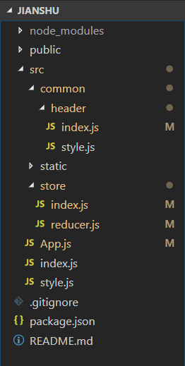

仿简书项目 - 3 - Redux 数据管理
===

>  **2018-9-10 16:17:24**  
> Recently revised in **2018-9-11 12:20:06**

<br>

## 第三章 Redux 数据管理

<br>

### 3.1 Redux
1. 安装 `redux`： `npm i redux -D`
2. 安装 `react-redux`：`npm i react-redux -D`
3. 创建 `store` 文件夹
4. 创建 `index.js` 文件
5. 此时目录如下：



6. 修改下面的文件：
> App.js
```
import React, { Component } from 'react';
import { Provider } from 'react-redux';
import Header from './common/header';
import store from './store';

class App extends Component {
  render() {
    return (
      <Provider store={store}>
        <Header />
      </Provider>
    );
  }
}

export default App;
```

> store/index.js
```
import { createStore } from 'redux';
import reducer from './reducer';

const store = createStore(reducer);

export default store;
```

> store/reducer.js
```
const defaultState = {
    focused: false
};

export default (state = defaultState, action) => {
    return state;
}
```

> common/header/index.js
```
import React, { Component } from 'react';
import { connect } from 'react-redux';
import { CSSTransition } from 'react-transition-group';
import {
    HeaderWrapper, Logo, Nav, NavItem, NavSearch, Addition, Button, SearchWrapper
} from './style'

class Header extends Component {
    constructor(props) {
        super(props);
        this.handleInputFocus = this.handleInputFocus.bind(this);
        this.handleInputBlur = this.handleInputBlur.bind(this);
    }

    render() {
        return (
            <HeaderWrapper>
                <Logo/>
                <Nav>
                    <NavItem className="left active">
                        <svg className="icon" aria-hidden="true">
                            <use xlinkHref="#icon-shouye"></use>
                        </svg>
                        <span> 首页</span>
                    </NavItem>
                    <NavItem className="left">
                        <svg className="icon" aria-hidden="true">
                            <use xlinkHref="#icon-xiazaiAPP"></use>
                        </svg>
                        <span> 下载App</span>
                    </NavItem>
                    <NavItem className="right">登录</NavItem>
                    <NavItem className="right">Aa</NavItem>
                    <SearchWrapper>
                        <CSSTransition
                            in={this.props.focused}
                            timeout={500}
                            classNames="slide"
                        >
                        <NavSearch
                            className={this.props.focused ? 'focused' : ''} 
                            onFocus={this.handleInputFocus}
                            onBlur={this.handleInputBlur}
                        ></NavSearch>
                        </CSSTransition>
                        <div className={this.props.focused ? 'focused icon-search' : 'icon-search'}>
                            <svg className="icon" aria-hidden="true">
                                <use xlinkHref="#icon-icon_search"></use>
                            </svg>
                        </div>
                    </SearchWrapper>
                </Nav>
                <Addition>
                    <Button className="writting">
                        <svg className="icon" aria-hidden="true">
                            <use xlinkHref="#icon-yumao"></use>
                        </svg>
                        <span> 写文章</span>
                    </Button>
                    <Button className="reg">注册</Button>
                </Addition>
            </HeaderWrapper>
        )
    }

    handleInputFocus() {
        this.setState({
            focused: true
        })
    }

    handleInputBlur() {
        this.setState({
            focused: false
        })
    }
}

const mapStateToProps = (state) => {
    return {
        focused: state.focused
    }
}

const mapDispathToProps = (dispatch) => {
    return {

    }
}

export default connect(mapStateToProps, mapDispathToProps)(Header);
```
7. 修改 common/header/`index.js` 以及 src/store/`reducer.js` 这两个文件：
> common/header/index.js
```
import React from 'react';
import { connect } from 'react-redux';
import { CSSTransition } from 'react-transition-group';
import {
    HeaderWrapper, Logo, Nav, NavItem, NavSearch, Addition, Button, SearchWrapper
} from './style'

const Header = (props) => {
    return (
        <HeaderWrapper>
            <Logo/>
            <Nav>
                <NavItem className="left active">
                    <svg className="icon" aria-hidden="true">
                        <use xlinkHref="#icon-shouye"></use>
                    </svg>
                    <span> 首页</span>
                </NavItem>
                <NavItem className="left">
                    <svg className="icon" aria-hidden="true">
                        <use xlinkHref="#icon-xiazaiAPP"></use>
                    </svg>
                    <span> 下载App</span>
                </NavItem>
                <NavItem className="right">登录</NavItem>
                <NavItem className="right">Aa</NavItem>
                <SearchWrapper>
                    <CSSTransition
                        in={props.focused}
                        timeout={500}
                        classNames="slide"
                    >
                    <NavSearch
                        className={props.focused ? 'focused' : ''} 
                        onFocus={props.handleInputFocus}
                        onBlur={props.handleInputBlur}
                    ></NavSearch>
                    </CSSTransition>
                    <div className={props.focused ? 'focused icon-search' : 'icon-search'}>
                        <svg className="icon" aria-hidden="true">
                            <use xlinkHref="#icon-icon_search"></use>
                        </svg>
                    </div>
                </SearchWrapper>
            </Nav>
            <Addition>
                <Button className="writting">
                    <svg className="icon" aria-hidden="true">
                        <use xlinkHref="#icon-yumao"></use>
                    </svg>
                    <span> 写文章</span>
                </Button>
                <Button className="reg">注册</Button>
            </Addition>
        </HeaderWrapper>
    )
}

const mapStateToProps = (state) => {
    return {
        focused: state.focused
    }
}

const mapDispathToProps = (dispatch) => {
    return {
        handleInputFocus() {
            const action = {
                type: 'search_focus'
            };
            dispatch(action);
        },
        handleInputBlur() {
            const action = {
                type: 'search_blur'
            };
            dispatch(action);
        }
    }
}

export default connect(mapStateToProps, mapDispathToProps)(Header);
```

> src/store/reducer.js
```
const defaultState = {
    focused: false
};

export default (state = defaultState, action) => {
    if(action.type === 'search_focus') {
        return {
            focused: true
        }
    }
    if(action.type === 'search_blur') {
        return {
            focused: false
        }
    }
    return state;
}
```
8. 新建 `store` 文件夹
9. 新建 `index.js` 文件
10. 新建 `reducer.js` 文件
11. 以此对 redux 进行拆分：
> common/header/store/index.js
```
import reducer from './reducer';

export { reducer };
```

> common/header/store/reducer.js
```
const defaultState = {
    focused: false
};

export default (state = defaultState, action) => {
    if(action.type === 'search_focus') {
        return {
            focused: true
        }
    }
    if(action.type === 'search_blur') {
        return {
            focused: false
        }
    }
    return state;
}
```

> common/header/index.js
```
const mapStateToProps = (state) => {
    return {
        focused: state.header.focused
    }
}
```

> src/store/reducer.js
```
import { combineReducers } from 'redux';
import { reducer as headerReducer } from '../common/header/store';

const reducer = combineReducers({
    header: headerReducer
});

export default reducer;
```

12. 新建 common/header/store/`actionCreators.js`：
> actionCreators.js
```
export const searchFocus = () => ({
    type: 'search_focus'
});

export const searchBlur = () => ({
    type: 'search_blur'
});
```
13. 修改 common/header/index.js：
> index.js
```
import * as actionCreators from './store/actionCreators';

const mapDispathToProps = (dispatch) => {
    return {
        handleInputFocus() {
            dispatch(actionCreators.searchFocus());
        },
        handleInputBlur() {
            dispatch(actionCreators.searchBlur())
        }
    }
}
```
14. 新建 common/header/store/`actionTypes.js`：
> actionTypes.js
```
export const SEARCH_FOCUS = 'header/SEARCH_FOCUS';
export const SEARCH_BLUR = 'header/SEARCH_BLUR';
```
15. 在 `actionCreators.js` 中引用该常量拆分组件：
> actionCreators.js
```
import * as actionTypes from './actionTypes';

export const searchFocus = () => ({
    type: actionTypes.SEARCH_FOCUS
});

export const searchBlur = () => ({
    type: actionTypes.SEARCH_BLUR
});
```
16. 修改 header/store/`reducer.js`：
> reducer.js
```
import * as actionTypes from './actionTypes';

const defaultState = {
    focused: false
};

export default (state = defaultState, action) => {
    if(action.type === actionTypes.SEARCH_FOCUS) {
        return {
            focused: true
        }
    }
    if(action.type === actionTypes.SEARCH_BLUR) {
        return {
            focused: false
        }
    }
    return state;
}
```
17. 修改 common/header/store/`index.js`：
> index.js
```
import reducer from './reducer';
import * as actionCreators from './actionCreators';
import * as actionTypes from './actionTypes';

export { reducer, actionCreators, actionTypes };
```
18. 修改 common/header/`index.js`：
```
import { actionCreators } from './store';
```
19. 安装 `immutable`：`npm i immutable -D`
20. 修改 common/header/store/`reducer.js`：
> reducer.js
```
import * as actionTypes from './actionTypes';
import { fromJS } from 'immutable';

const defaultState = fromJS({
    focused: false
});

export default (state = defaultState, action) => {
    if(action.type === actionTypes.SEARCH_FOCUS) {
        return state.set('focused', true);
    }
    if(action.type === actionTypes.SEARCH_BLUR) {
        return state.set('focused', false);
    }
    return state;
}
```
21. 修改 common/header/`index.js`：
> index.js
```
const mapStateToProps = (state) => {
    return {
        focused: state.header.get('focused')
    }
}

```

<br>

 