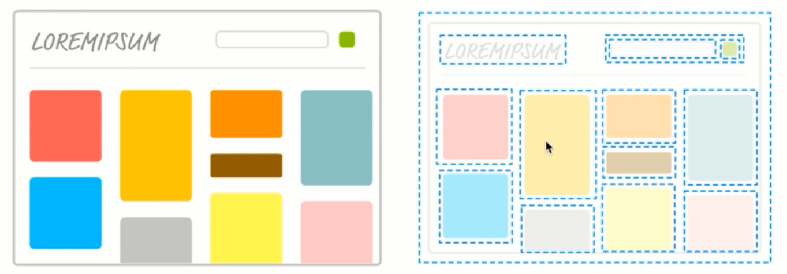

React - 2 - 组件
===

>  **2018年9月5日10:41:14**  
> Recently revised in **2018-10-28 10:54:44**

## 第二章 组件
&emsp;每个网站，是由多个 html 页面组成的，而 html 页面，可以看成是多个组件组成的。  
&emsp;所谓组件，就是如 “庖丁解牛” 般，将网站划分为多个 “块” ，这里我们使用 index.html 页面进行讲解：



&emsp;在这里，我们将网站分成了很多 “块” 。网站生成中，我们将不同的组件，纷纷以 dom 的形式，加载到 index.html 文件中，从而就有了我们一个完整的 index.html。  
&emsp;学过 HTML5 的小伙伴，应该对 \<header\>、\<sidebar\>、\<footer\> 这类标签有很深的感触，那么，react 或者 vue 或者 angular 中出现的组件概念，就跟这些标签一样，起到 “庖丁解牛” 般的作用。

### 2.1 React 组件
&emsp;在这里，我们以 `第一章` 中的 App.js 进行 react 组件的讲解：
```
import React, { Component } from 'react';

class App extends Component {
  render() {
    return (
      <h3>Hello React!</h3>
    );
  }
}

export default App;
```
&emsp;在这段代码中，我们就通过 import 引用了 react 的组件： Component，然后在下面定义了 App 这个类来继承 react 的组件类。  
&emsp;如果我们不使用 `import { Component } from 'react`，那么，我们在 `class App extends Component`中可以改写为 `class App extends React.Component`，一样可以起到相同的作用，但是为了方便，我们通常直接引用 `react` 中的 `Component` 这个类，再使用 `render()` 方法渲染 dom 并导出 App 这个类。  
&emsp;上面代码可以改写为：
```
import React, { Component } from 'react';

/**
 * import { Component } from 'react';
 * 
 * 等价于
 * 
 * import React from 'react'
 * const Component = React.Component
 */

class App extends React.Component {
  render() {
    return (
      <h3>Hello React!</h3>
    );
  }
}

export default App;
```

<br>

### 2.2 导入组件
&emsp;在上面，我们定义了一个组件 App，那么，该组件是怎么被使用的呢？  
&emsp;我们先看下 index.js 的内容：
```
import React from 'react';
import ReactDOM from 'react-dom';
import App from './App';

ReactDOM.render(<App />, document.getElementById('root'));
```
&emsp;在 index.js 中，我们通过 import 从 App.js 中引用了 App 这个类，然后通过 `ReactDOM.render(<App />, document.getElementById('root'));` 这行代码中，我们将组件渲染到了 root 这个节点，从而实现了组件的加载。

<br>

###  目录
| 章节名 | 导航                                |
| ------ | ----------------------------------- |
| 第一章 | [基础环境搭建](./react-chapter1.md) |
| 第二章 | [组件](./react-chapter2.md)         |
| 第三章 | [JSX 语法](./react-chapter3.md)     |

<br>

 
