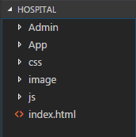
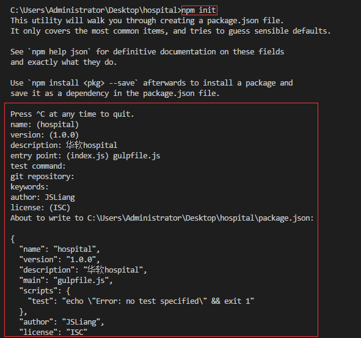
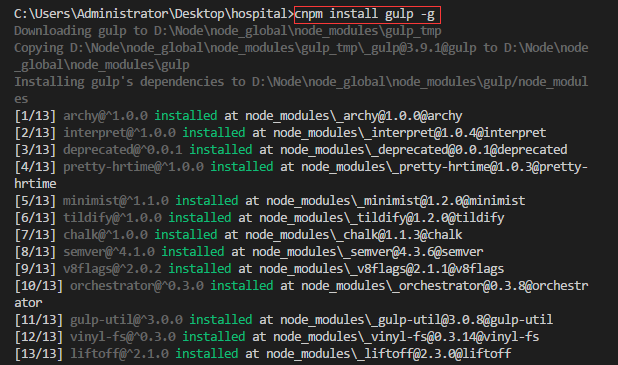
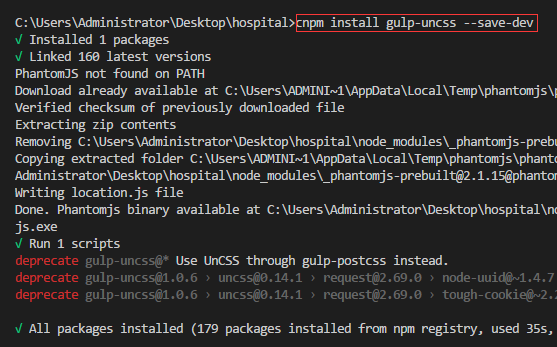
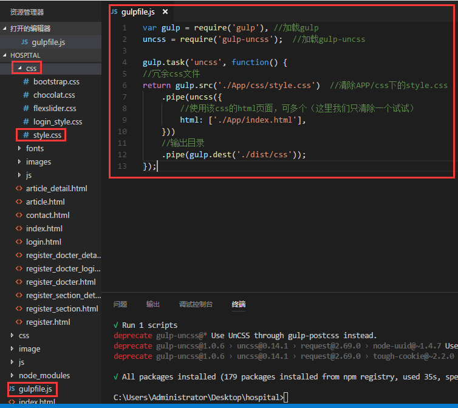
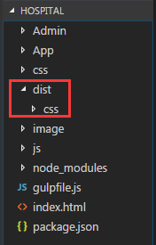
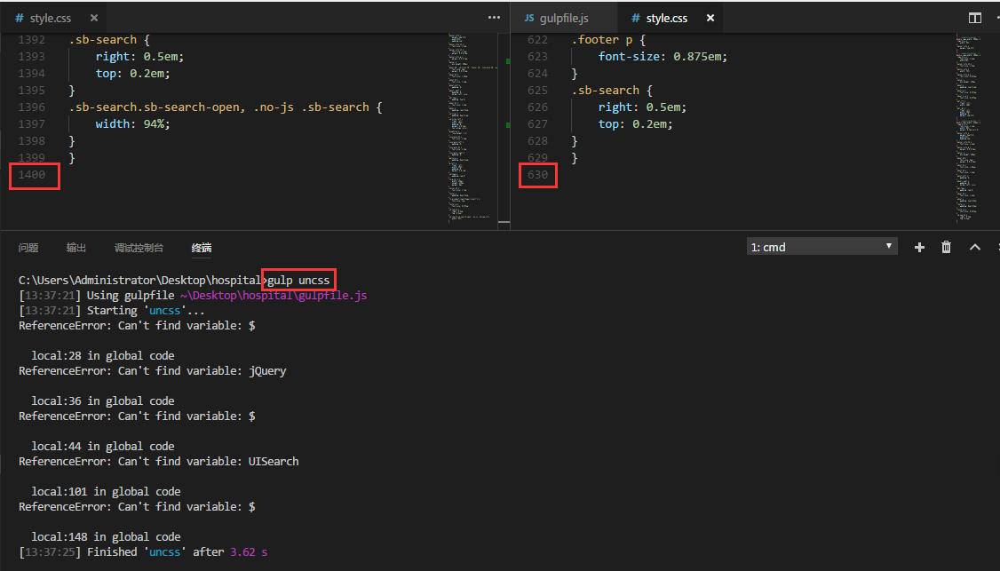

# gulpUncss清除样式
>  **2017-10-24**  
> Recently revised in **2018-9-18 22:43:32**

<br>

&emsp;套用模板、编写大型网站的时候，经常会写了很多没用的CSS代码，尤其是没有分好类、写好备注的时候，就会感觉很麻烦，这时候就可以使用gulp-uncss来精简样式，去掉没用的css代码。  
&emsp;首先找到你要精简样式的目录：  



&emsp;然后安装node：http://nodejs.cn/  
&emsp;接着新建一个目录放gulp项目：`npm init`  



<br>

&emsp;再接着安装gulp：cnpm install gulp -g  



<br>

&emsp;然后安装gulp-uncss：cnpm install gulp-uncss --save-dev  



<br>

&emsp;再然后在项目中新建一个gulpfile.js：  



&emsp;代码如下：
```
var gulp = require('gulp'), //加载gulp
uncss = require('gulp-uncss'); //加载gulp-uncss

gulp.task('uncss', function() {
    //冗余css文件
    return gulp.src('./App/css/style.css') //清除APP/css下的style.css
    .pipe(uncss({
        //使用该css的html页面，可多个（这里我们只清除一个试试）
        html: ['./App/index.html'],
    }))
    //输出目录
    .pipe(gulp.dest('./dist/css'));
});
```

<br>

&emsp;接着新建好输出目录的文件夹：  



<br>

&emsp;最后执行gulp uncss：  



<br>

&emsp;这样，就可以看到，原本1300行的CSS清除到630行了，我们使用gulp-uncss清除样式成功啦~。  

<br>

 