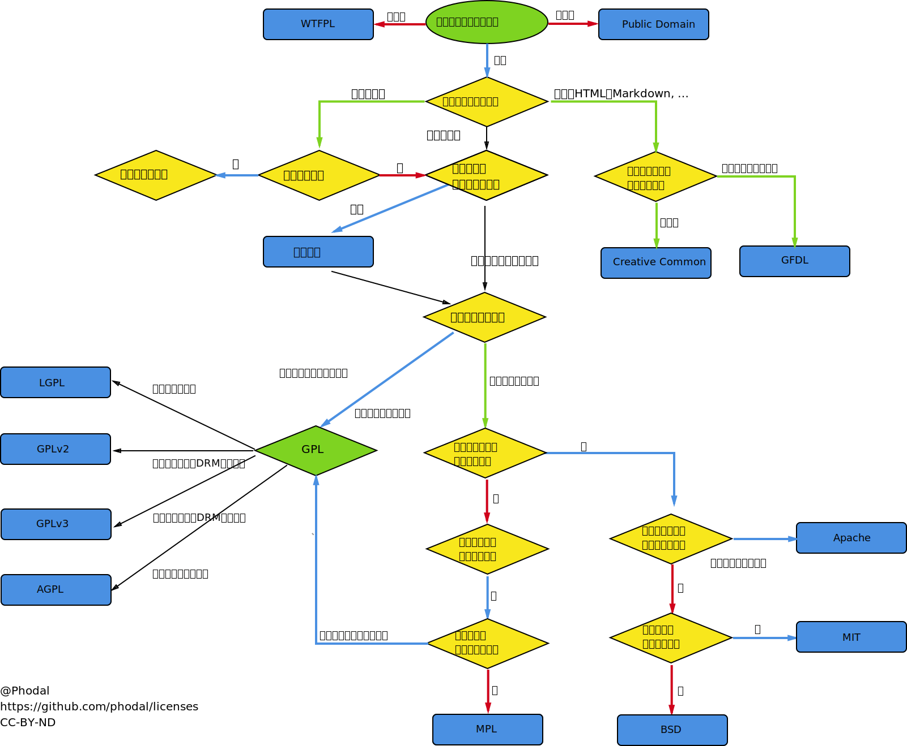

关于协议
===

>  **2018-8-22 17:58:56**  
> Recently revised in **2018-10-15 21:57:06**

* 由于担心自己的知识产品被无良厂商/个人拿去非法盈利，所以 特意去查了下关于协议的知识，下面是查询结果，分享给想了解协议的小伙伴们。
* 阮一峰关于协议的见解 [查看详情](http://www.ruanyifeng.com/blog/2011/05/how_to_choose_free_software_licenses.html)

* Phodal关于协议的见解 [查看详情](https://www.sohu.com/a/193996518_385076)

> 事实上，我们大多数时候仅仅“了解”这些协议有大概有什么用，却很少把它使用到我们的项目中。就好比在这里我使用了一种保护markdown文档的许可证，但是，实际上我也不知道它究竟有没有作用。

1. **GPL许可证**：
    * GPL协议的出发点是源代码的开源与免费使用，同时对其衍生代码进行引用、修改，但是引用、修改后代码必须开源与免费使用，即不允许修改后和衍生后的代码作为闭源的商业软件发布和销售。因此，有保密要求的部门不适合对具有GPL协议的开源代码进行集成、采用类库或者二次开发。
   * GPL协议具有“传染性”。当一个软件中使用（“使用”指类库引用，修改后的代码或衍生代码）GPL协议的产品，则该软件产品必须也采用GPL协议，即必须也是免费和开源，这就是它所谓的“传染性”。
   * GPL协议保障原作者的知识产权，避免有人利用开源代码复制并开发类似的产品。所以有GPL协议的软件，在适用于大众去免费开发的同时，专利者也可以出售其版权获得利益。例如：甲骨文买走MySQL的版权，但是这个软件，它的使用权，免费权，开发权都在大众手里，甲骨文只有一个挂名权而已。
2. **LGPL许可证**：
   * LGPL协议大部分等同于GPL协议，但它是基于GPL的，一个主要为类库使用设计的开源协议。
   * 与GPL不同之处：允许商业软件通过类库引用（link）方式使用LGPL类库而不需要开源商业软件的代码，因此其可以被商业软件作为类库引用并发布和销售。
   * LGPL协议保障原作者的知识产权，避免有人利用开源代码复制并开发类似的产品。
3. **MPL许可证**：
   * MPL协议是The Mozilla Public License的简写，是1998年初Netscape的Mozilla小组为其开源软件项目设计的软件许可证。
   * MPL允许被许可人经过MPL许可证获得的源代码同其他类型的代码进行混合得到自己的软件程序。
4. **BSD许可证**：  
   * 给与使用者很大自由的协议，可以自由的使用或者修改源代码，也可以将修改后的代码作为开源或者专有软件再发布。  
   * BSD由于允许使用者修改和重新发布代码，也允许使用或在BSD代码上开发商业软件发布和销售，因此对商业集成很友好。  
   * 而很多的公司企业在选用开源产品的时候都首选BSD协议，因此可以完全控制这些第三方的代码，在必要的时候可以修改或者二次开发。
5. **MIT许可证**：
   * MIT协议中，作者只想保留版权，而不做任何其他限制。
   * 使用者必须在使用的发行版里包含原许可协议的声明，无论是否以二进制发布还是以源代码发布。
6. **Apache许可证**：
   * Apache协议是著名的非盈利开源组织Apache采用的协议。
   * Apache协议类似于BSD许可证，鼓励代码共享和尊重原作者的著作权，同样允许代码修改，再发布。
   * Apache同样也对商业友好。使用者也可以在需要的时候修改代码来满足并作为开源或商业产品发布/销售。

&emsp;这里仅进行简单介绍。如果你需要使用GPL、LGPL、MPL、BSD、MIT、Apache等协议，请认真百度/Chrome相关知识后再采用。如果你对上面说法持有异议，请联系上面的邮箱，督促 进行修改。另：本文档采用 [CC BY-NC-SC 4.0版本协议](https://creativecommons.org/licenses/by-nc-sa/2.5/cn/)，该协议可以作用于markdown编写的电子文档，有兴趣的小伙伴可以点击前面链接去看看。

 

***
>  document library of   by <a xmlns:cc="http://creativecommons.org/ns#" href="https://github.com/LiangJunrong/document-library" property="cc:attributionName" rel="cc:attributionURL">梁峻荣</a> is licensed under a <a rel="license" href="http://creativecommons.org/licenses/by-nc-sa/4.0/">Creative Commons Attribution-NonCommercial-ShareAlike 4.0 International License</a>. Based on a work at <a xmlns:dct="http://purl.org/dc/terms/" href="https://github.com/LiangJunrong/document-library" rel="dct:source">https://github.com/LiangJunrong/document-library</a>. Permissions beyond the scope of this license may be available at <a xmlns:cc="http://creativecommons.org/ns#" href="https://creativecommons.org/licenses/by-nc-sa/2.5/cn/" rel="cc:morePermissions">https://creativecommons.org/licenses/by-nc-sa/2.5/cn/</a>.

>    的文档库 由 <a xmlns:cc="http://creativecommons.org/ns#" href="https://github.com/LiangJunrong/document-library" property="cc:attributionName" rel="cc:attributionURL">梁峻荣</a> 采用 <a rel="license" href="http://creativecommons.org/licenses/by-nc-sa/4.0/">知识共享 署名-非商业性使用-相同方式共享 4.0 国际 许可协议</a>进行许可。 基于<a xmlns:dct="http://purl.org/dc/terms/" href="https://github.com/LiangJunrong/document-library" rel="dct:source">https://github.com/LiangJunrong/document-library</a>上的作品创作。 本许可协议授权之外的使用权限可以从 <a xmlns:cc="http://creativecommons.org/ns#" href="https://creativecommons.org/licenses/by-nc-sa/2.5/cn/" rel="cc:morePermissions">https://creativecommons.org/licenses/by-nc-sa/2.5/cn/</a> 处获得。